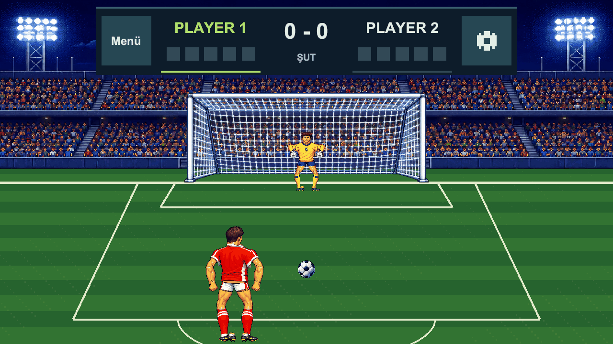

# Penalty King

A local two-player penalty shootout game for Android, built with Unity and C#. Two players share one phone, secretly choose their moves, and alternate between striker and goalkeeper in a pixel-art night stadium.



## Gameplay

1. Open **Play → 2 Kişilik** (two players), then choose **Sabit Round** or **Endless**.
2. The striker dismisses the turn card and selects one of six goal regions: left, center, or right, each with a low and high option.
3. Pass the phone to the goalkeeper. The striker's choice stays hidden while the goalkeeper chooses a save region.
4. Matching choices produce a save; different choices produce a goal. Roles switch after each attempt.

**Fixed Round** gives each player five shots and permits a draw. **Endless** continues after both goals and saves. The scoreboard displays each player's score and recent attempts. An interactive first-match guide includes practice shots that do not affect the score.

## Features

- Pass-and-play matches on a single device.
- Pixel characters with continuous 2D bone animation and two-handed saves.
- Animated crowd celebrations, goal-net effects, and a night-stadium pitch.
- Chiptune menu music, recorded crowd ambience, and separate music/SFX controls.
- Persistent vibration preference and Android goal haptics.
- In-game settings, pause/exit confirmation, replay, and safe-area-aware UI.

Online play is disabled in the current build. There is no AI opponent or difficulty selection.

## Open the project

### Requirements

- **Unity 6000.4.4f1**, as recorded in [ProjectVersion.txt](ProjectSettings/ProjectVersion.txt).
- Unity Hub.
- Android Build Support, including SDK, NDK, and OpenJDK, when building for Android.

Clone the repository and add its root folder to Unity Hub:

```bash
git clone https://github.com/metehancihangir/penaltyking.git
```

Open **Assets/Scenes/MainMenu.unity**, then press **Play**. An empty Untitled scene does not contain the game. For a landscape preview, select **16:9 / 1280×720** in the Game view.

Dependencies are declared in [Packages/manifest.json](Packages/manifest.json), including Universal Render Pipeline, 2D Animation, the Input System, and Unity Test Framework.

## Project layout

| Path | Purpose |
| --- | --- |
| `Assets/Scripts/Core/` | Game state, rules, audio preferences, and scene navigation |
| `Assets/Scripts/Gameplay/` | Penalty rounds, character rigs, shot presentation, and haptics |
| `Assets/Scripts/UI/` | Menus, turn handoff, tutorial, scoreboard, and visual effects |
| `Assets/Scenes/` | Prepared game scenes |
| `Assets/Editor/` | Scene setup, preview, and Android build utilities |
| `Assets/Tests/PlayMode/` | Gameplay and presentation tests |
| `Tools/` | Android smoke-test and verification scripts |
| `docs/` | Development reports, previews, and asset attribution |

## Development and testing

Run **Window → General → Test Runner → PlayMode → Run All** in Unity.

The scenes are already prepared. Older scene generators can overwrite newer layouts. The documented setup sequence uses `PenaltyKing.Editor.PreSevenPolish.Build`, with the current bone/crowd setup applied through `PenaltyKing.Editor.BoneRigRevision.Setup`. The Android build utility is `PenaltyKing.Editor.CrowdRevision.Android`.

The Android smoke scripts include `Tools/update7_android_smoke.py` and `Tools/playback_fix_android_smoke.py`; inspect their device and tool paths before running them. Use a dedicated emulator for tests that reset saved data. Do not start a second Unity batch process while the same project is open in the Editor.

## Build status and assets

The previous README records a local Android development package named `Builds/Android/PenaltyKing-update7-crowd.apk` (0.2.2, version code 4; Android 8+, ARM64/x86_64). That package is **not included in the tracked repository** and predates the September 9–12 visual changes. Build from source to use the current scenes.

The latest documented visual revision and its verification notes are in the [bone-rig report](docs/bone-rig-raporu.md). Older phase reports describe earlier versions; their test counts are not a claim about the current checkout. Physical-device vibration verification remains a separate manual check.

See [audio sources and licenses](docs/audio-source/README.md) for third-party recordings and attribution. Additional development notes are in [update-notes.md](update-notes.md); some supporting documents are in Turkish.
